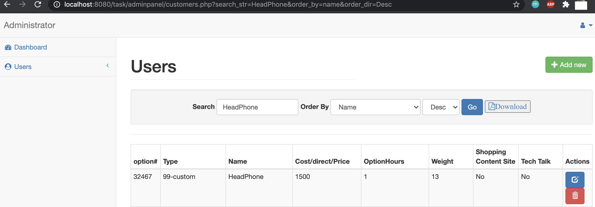

# corporatecoders
## PHP Admin User Page

**Tech Stack:**
```
PHP version: 7.4.6
Web Server: Apache/2.4.38 (Debian)
MySql: 8.0.20
fpdf: 1.8
phpMyAdmin: 5.0.2
Docker: 2.3
```

**Setting up Environment**
```
docker run -p 3306:3306 --name test-mysql -e MYSQL_ROOT_PASSWORD=mypasswd -d mysql:8.0

docker run -v /localfilepath:/var/www/html/task --name myadmin -d --link test-mysql:db -p 8080:80 phpmyadmin/phpmyadmin
```

Copy this repo files to the localpath which will be mounted to docker container.

**Setting up Environment**
Admin Login: root
Password: root





